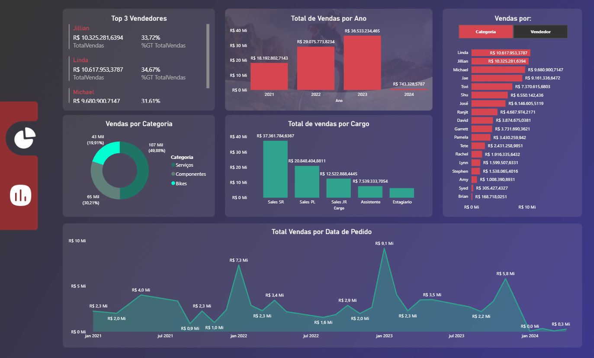

# Projeto BI - Análise de Vendas Loja de Bikes 🚴

## 📍 Objetivo
Transformar dados de vendas em informações estratégicas para apoiar decisões comerciais futuras.

## 🛠 Tecnologias Utilizadas
- **Power BI**: para análise e visualização de dados
- **DAX**: fórmulas e cálculos para métricas personalizadas
- **Base de dados fictícia**: simulando vendas e performance da loja

## 📊 Métricas Utilizadas
- Total de Vendas
- Quantidade Vendida
- Performance por Vendedor
- Análise por Categoria
- Evolução Temporal

## 📝 Principais Insights

### Crescimento Anual
A empresa apresentou crescimento consistente entre 2021 e 2023, seguido de queda em 2024, indicando possível mudança de cenário ou período incompleto.
### Concentração de Receita
Alta dependência de vendedores específicos, representando risco operacional.
### Bikes em volume, Serviços em Valor
Apesar de Bikes apresentarem maior volume de vendas, a categoria Serviços gera maior receita, indicando maior valor por transação e potencial de margem superior.
### Impacto da Senioridade
Cargos mais experientes apresentam maior contribuição para a receita.
### Sazonalidade
Identificação de períodos com maior volume de vendas, sugerindo oportunidades de campanhas direcionadas.
## 🔎 Possíveis Ações Estratégicas
- Treinamento de equipe para reduzir concentração de receita
- Planejamento de estoque baseado em sazonalidade
- Investigação da queda em 2024
## 💡 Conclusão
A análise revela o impacto do uso de BI na geração de insights estratégicos e suporte à tomada de decisão.

